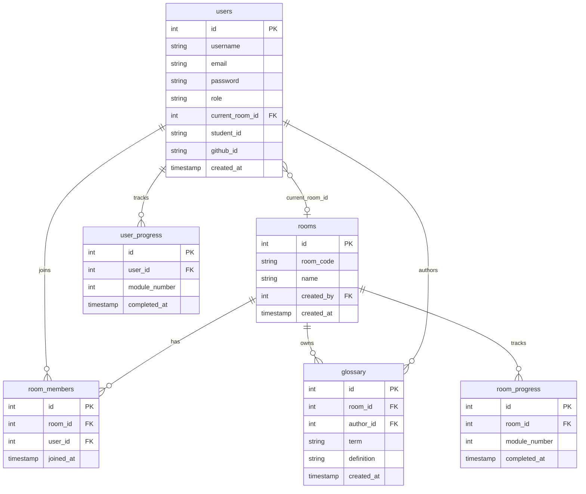
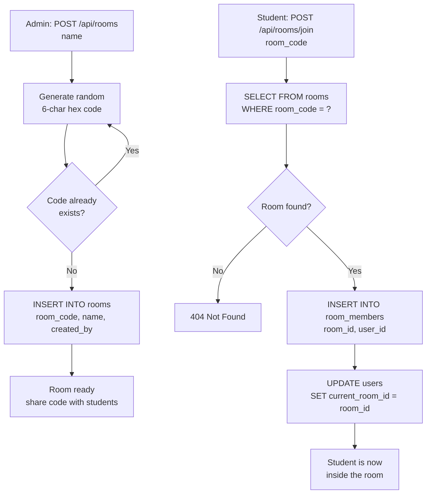
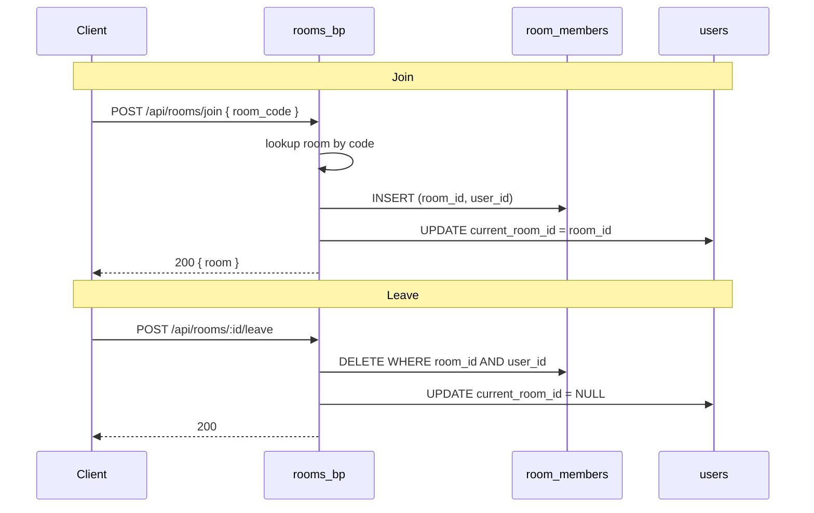
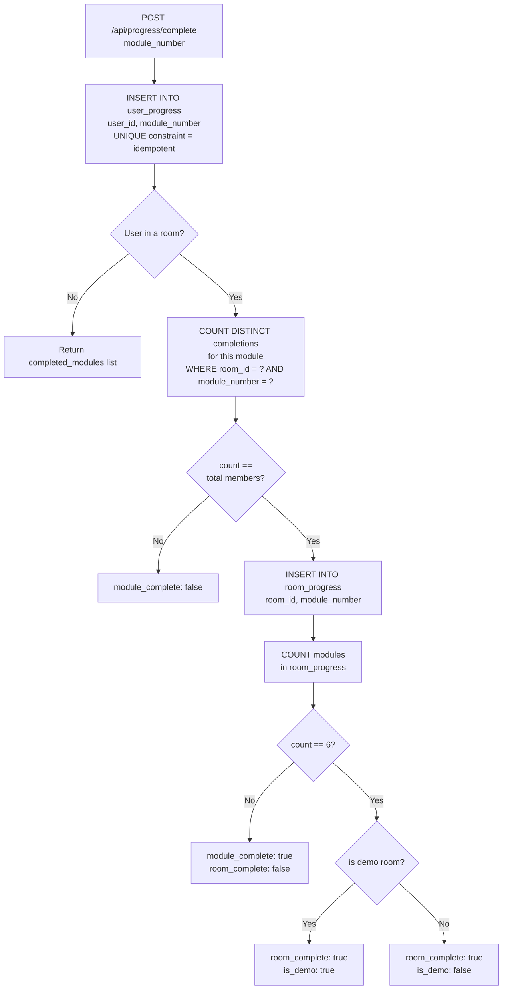
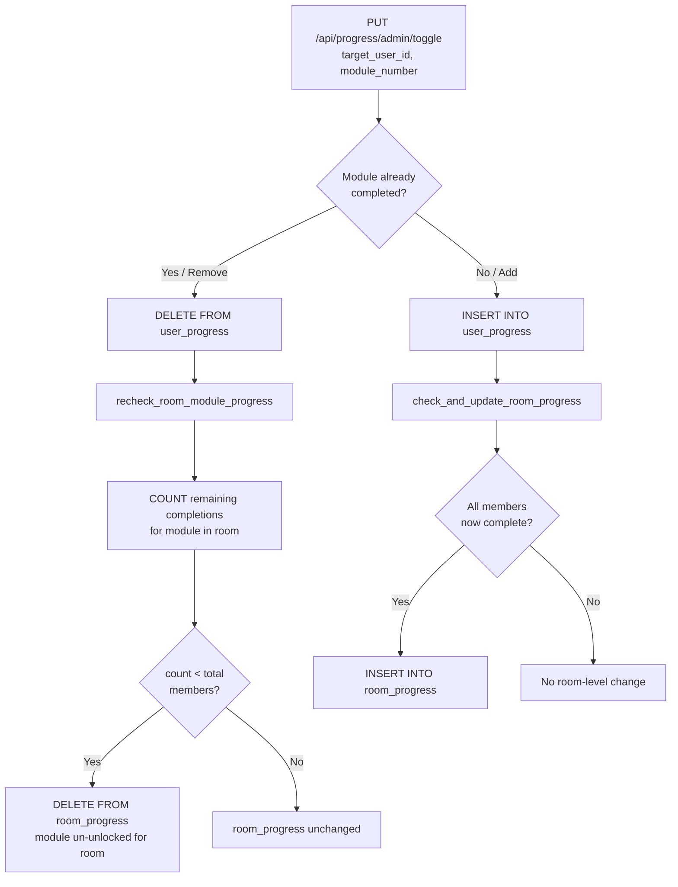
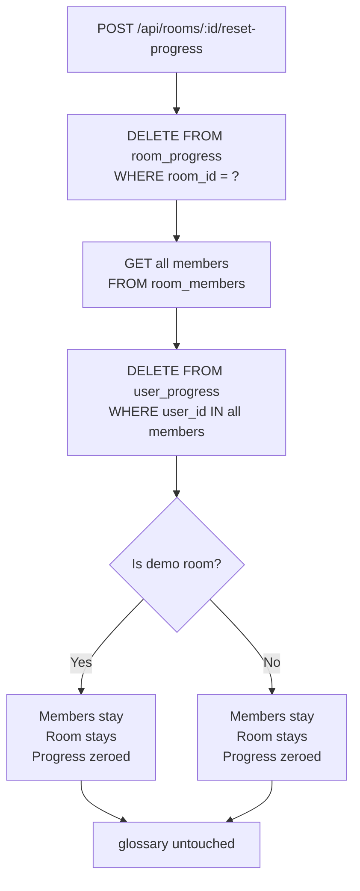

# Quest — Transactional Data & Room Code System

## Database Schema

---

## Room Code System

Rooms are identified by a unique 6-character hex code (e.g. `A3F9C2`). Students never deal with internal IDs — they join by code. The demo room `DEMO01` is a special hardcoded code that always exists and cannot be deleted.

---

## Room Membership — Two-Write Sync

Joining and leaving a room always touches two tables together. `room_members` holds the official membership record. `users.current_room_id` is a shortcut pointer used by the frontend to know which room the user is currently active in.

---

## Module Completion — User to Room Rollup

Individual completions live in `user_progress`. A module only graduates to `room_progress` once **every member** of the room has completed it. This is the core collaborative mechanic of the room code system.

---

## Admin Toggle — Bidirectional Sync

Admins can manually add or remove a module completion for any user. Because `room_progress` is derived from `user_progress`, toggling one user's record must recheck whether the room-level entry should be added or revoked.

---

## Progress Reset

Resetting a room wipes both tiers of progress. Glossary entries survive a reset intentionally — collaborative knowledge persists across attempts.

---

## Delete Cascade

Full deletion clears all relational data in dependency order.

```mermaid
flowchart TD
    subgraph Delete Room
        R1[DELETE room] --> R2[UPDATE users\nSET current_room_id = NULL\nfor all members]
        R2 --> R3[DELETE FROM glossary\nWHERE room_id]
        R3 --> R4[DELETE FROM room_progress\nWHERE room_id]
        R4 --> R5[DELETE FROM room_members\nWHERE room_id]
        R5 --> R6[DELETE FROM rooms\nWHERE id]
    end

    subgraph Delete User
        U1[DELETE user] --> U2[DELETE FROM user_progress\nWHERE user_id]
        U2 --> U3[DELETE FROM room_members\nWHERE user_id]
        U3 --> U4[DELETE FROM glossary\nWHERE author_id]
        U4 --> U5[UPDATE users\nSET current_room_id = NULL]
        U5 --> U6[DELETE FROM users\nWHERE id]
    end
```

> The demo room `DEMO01` is protected at the model layer — `delete_room()` exits early if `is_demo_room()` returns true. It can be reset but never deleted.
