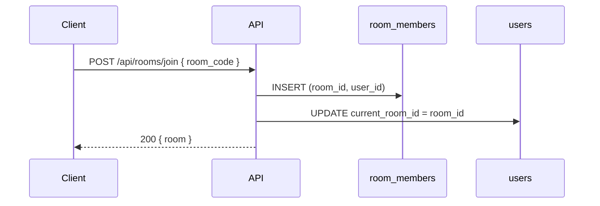
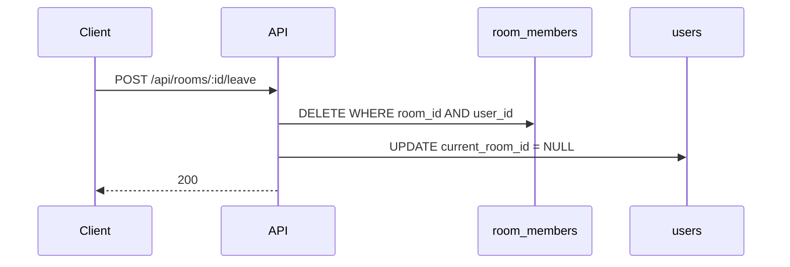
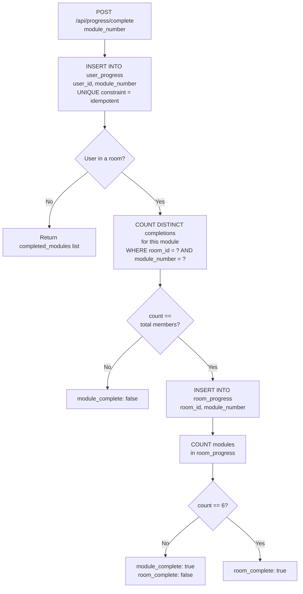
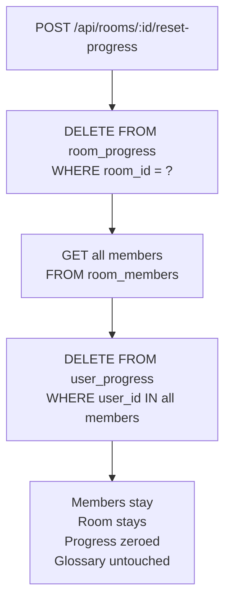

# Quest — Transactional Data & Room Code System

## Database Schema

---

## Room Code System

Rooms are identified by a unique 6-character hex code (e.g. `A3F9C2`). Students never deal with internal IDs — they join by code.

---

## Room Membership — Two-Write Sync

Every join or leave writes to two tables. `room_members` is the source of truth for membership. `users.current_room_id` is a pointer the frontend uses to know which room the user is currently in — it must stay in sync.

**Join**

**Leave**

---

## Module Completion — User to Room Rollup

Individual completions live in `user_progress`. A module only graduates to `room_progress` once **every member** of the room has completed it. This is the core collaborative mechanic of the room code system.

---

## Admin Toggle — Bidirectional Sync

Admins can manually add or remove a module completion for any user. Because `room_progress` is derived from `user_progress`, toggling one user's record must recheck whether the room-level entry should be added or revoked.

---

## Progress Reset

Resetting a room wipes both tiers of progress. Glossary entries survive a reset intentionally — collaborative knowledge persists across attempts.

---

## Delete Cascade

Full deletion clears all relational data in dependency order.

